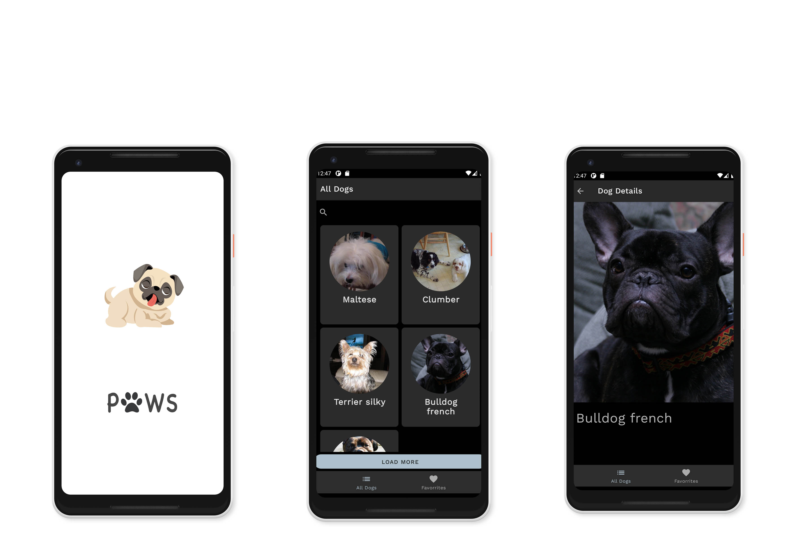

An Android Application written purely in Kotlin utilizing all the latest tech in Android.   The project uses Material Design guidelines,  MVVM architecture, Hilt for Dependency Injection and uses Room for an offline- first approach.
  

# Medium Articles 
Follow me on [Medium](https://medium.com/@shivamdhuria) for latest articles.

  | Medium Article  | Github Branch|
| ------ | ------ |
| [What the Flows: Build an Android app using Flows, Live Data, and MVVM architecture](https://proandroiddev.com/what-the-flows-build-an-android-app-using-flows-and-live-data-using-mvvm-architecture-4d3ab807b4dd) | [begin_flows](https://github.com/Shivamdhuria/flows_guide/tree/begin_flows) |
| [Implementing Search Filter using Kotlin Channels and Flows in your Android Application](https://medium.com/@shivamdhuria/implementing-search-filter-using-kotlin-channels-and-flows-in-your-android-application-df7c96e58b19)  | [implementing_search_in_database](https://github.com/Shivamdhuria/flows_guide/tree/implementing_search_in_database)|
| Adding Hilt (No Article ❌) | [migrating_to_hilt](https://github.com/Shivamdhuria/flows_guide/tree/migrating_to_hilt) |
| [Adding animations to your Android application using Lottie library](https://medium.com/@shivamdhuria/adding-animations-to-your-android-application-using-lottie-library-fa2d7197e23b) | [adding_animation](https://github.com/Shivamdhuria/flows_guide/tree/add_animation_final) |
| Adding Stetho (Medium article in progress) | [adding_stetho](https://github.com/Shivamdhuria/flows_guide/tree/adding_stetho) |
| Migrating to Single Activity architecture with Navigation Components (No Article ❌) | [migrate_to_single_activity_and_navigation_component](https://github.com/Shivamdhuria/flows_guide/tree/migrate_to_single_activity_and_navigation_component) |
| [Adding amazing transitions to your Android App easily using Material Motion](https://medium.com/@shivamdhuria/adding-amazing-transitions-to-your-android-app-easily-using-material-motion-f0cd92463b39) | [added_transition_using_material_motion](https://github.com/Shivamdhuria/flows_guide/tree/added_transition_using_material_motion) |

## Tech Stack

- [Kotlin](https://kotlinlang.org/)  
- [Coroutines](https://github.com/Kotlin/kotlinx.coroutines)  
- [Flow](https://kotlin.github.io/kotlinx.coroutines/kotlinx-coroutines-core/kotlinx.coroutines.flow/) for asynchronous.
- Dagger-Hilt (alpha) for dependency injection.
- JetPack Components
- Material Design Components
- Navigation UI
- Architecture
  - MVVM Architecture 
  - Repository pattern
  - Database Cache as Single Source of Truth
  - Single activity Pattern
  
  
## Roadmap (Features to be added )
- Using Jetpack compose
- Animations using Jetpack compose
- Using fastlane for distribution
- Using Play Core Library for In App Updates
  
  
### Find this repository useful? :heart:
Support it by joining starring this repository. :star:  
And follow me on [Medium](https://medium.com/@shivamdhuria) and [Github](https://github.com/Shivamdhuria?tab=repositories)
  
  
### Issues and Contribution
Currently I am not taking in Pull requests(will start in a while) however you can always a raise an issue and I'll try fix it.

### Project Maintainers
This project is founded and actively maintained by [Shivam Dhuria](https://github.com/Shivamdhuria).

### Dog Api
Original dataset taken from the the Stanford Dogs Dataset. Logo thanks to NotKnifoon.
[Dog Api](https://dog.ceo/dog-api/about) provides hundreds of free pictures of dogs.
  
### Libraries
- [Retrofit2 & OkHttp3](https://github.com/square/retrofit) - construct the REST APIs and paging network data.
- [Moshi](https://github.com/square/moshi/) - A modern JSON library for Kotlin and Java.
- [Lottie](https://github.com/airbnb/lottie-android) - Lottie is a mobile library for Android and iOS that parses Adobe After Effects animations exported as json with Bodymovin and renders them natively on mobile!
- [Stetho](https://github.com/facebook/stetho) - Stetho is a sophisticated debug bridge for Android applications.
- [Gson](https://github.com/google/gson) - Gson is a Java library that can be used to convert Java Objects into their JSON representation.
- [Room](https://developer.android.com/topic/libraries/architecture/room) - For storing Database.
- [Glide](https://github.com/bumptech/glide) - Glide supports fetching, decoding, and displaying video stills, images, and animated GIFs.

